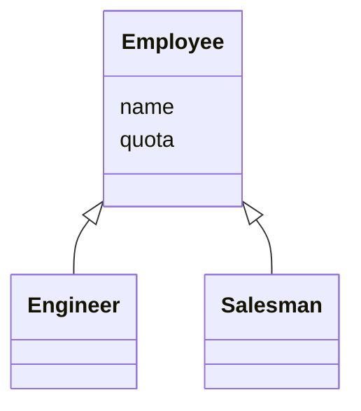

[](https://github.com/kaiosilveira/push-down-field-refactoring/actions/workflows/ci.yml)

ℹ️ _This repository is part of my Refactoring catalog based on Fowler's book with the same title. Please see [kaiosilveira/refactoring](https://github.com/kaiosilveira/refactoring) for more details._

---

# Push Down Field

<table>
<thead>
<th>Before</th>
<th>After</th>
</thead>
<tbody>
<tr>
<td>

```typescript
class Employee {
  protected quota: string;
}

class Engineer extends Employee { ... }
class Salesman extends Employee { ... }
```

</td>

<td>

```javascript
class Employee { ... }
class Engineer extends Employee { ... }
class Salesman extends Employee {
  private quota: string;
}
```

</td>
</tr>
</tbody>
</table>

**Inverse of: [Pull Up Field](https://github.com/kaiosilveira/pull-up-field-refactoring)**

As it often happens with class hierarchies, we have some specific fields that was firstly thought to be common to all subclasses, but end up being relevant just for some of those. This refactoring gives a glimpse of what to do in these cases.

## Working example

Our working example is a straightforward `Employee` class hierarchy:



Our goal is to move the `quota` field down to `Salesman`, since it's only used there.

### Test suite

Our test suite covers the basic properties of `Salesman`:

```javascript
describe('Salesman', () => {
  it('should have a name', () => {
    const salesman = new Salesman('Kaio');
    expect(salesman.name).toBe('Kaio');
  });

  it('should have a quota', () => {
    const salesman = new Salesman('Kaio');
    expect(salesman.quota).toBe(1.5);
  });
});
```

That's the minimum we need in place to get going.

### Steps

We start by copying the `quota` field into `Salesman`:

```diff
diff --git Salesman...
  constructor(name) {
    super(name, 1.5);
+   this.quota = 1.5;
  }
```

then we remove `quota` from `Employee` (and update the other subclass so they don't need to provide this value any longer):

```diff
diff --git Employee...
   constructor(name) {
-    super(name, 0);
+    super(name);
   }
```

And that's it!

### Commit history

Below there's the commit history for the steps detailed above.

| Commit SHA                                                                                                             | Message                              |
| ---------------------------------------------------------------------------------------------------------------------- | ------------------------------------ |
| [6b116ee](https://github.com/kaiosilveira/push-down-field-refactoring/commit/6b116ee42712ce8961ca2972d4ce7e7fc527fcbf) | copy `quota` field into `Salesman`   |
| [afe975e](https://github.com/kaiosilveira/push-down-field-refactoring/commit/afe975e5952e2bdfddb617bb67b2d040e84b5367) | remove `quota` field from `Employee` |

For the full commit history for this project, check the [Commit History tab](https://github.com/kaiosilveira/push-down-method-refactoring/commits/main).
